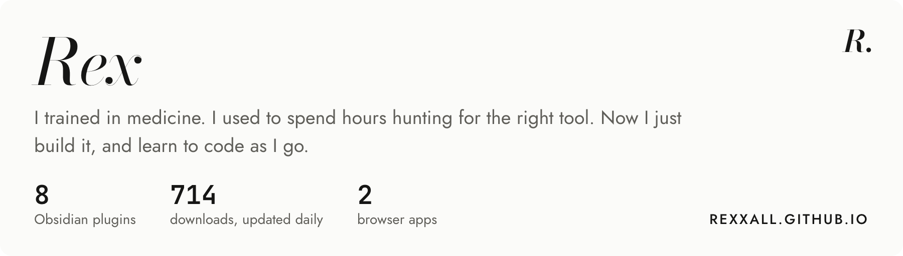
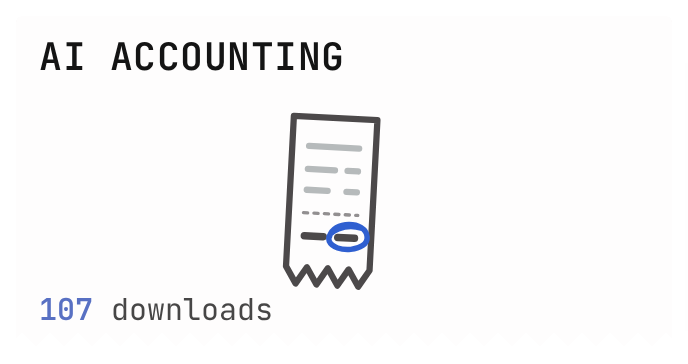
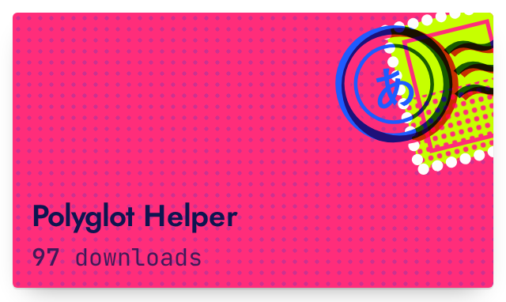
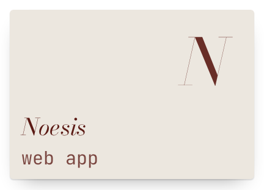
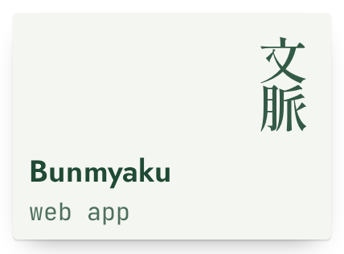

<a href="https://rexxall.github.io/"><picture><source media="(max-width: 600px) and (prefers-color-scheme: dark)" srcset="assets/wall/label-narrow-dark.png"><source media="(max-width: 600px)" srcset="assets/wall/label-narrow-light.png"><source media="(prefers-color-scheme: dark)" srcset="assets/wall/label-dark.png"></picture></a>

  

**Recent releases**

- [Video Summary 2.14.1](https://github.com/Rexxall/obsidian-video-summary/releases/tag/2.14.1) · 17 Nov 2026
- [AI Assistant Suite 1.9.2](https://github.com/Rexxall/obsidian-ai-assistant-suite/releases/tag/1.9.2) · 17 Nov 2026
- [AI Accounting 0.9.0](https://github.com/Rexxall/obsidian-ai-accounting/releases/tag/0.9.0) · 15 Nov 2026

The more downloads, the bigger the poster. Redrawn every morning from Obsidian’s stats file, last on 22 Nov 2026. More on <a href="https://rexxall.github.io/">rexxall.github.io</a>.
