<a href="https://rexxall.github.io/"><picture><source media="(prefers-color-scheme: dark)" srcset="assets/banner-dark.svg"> 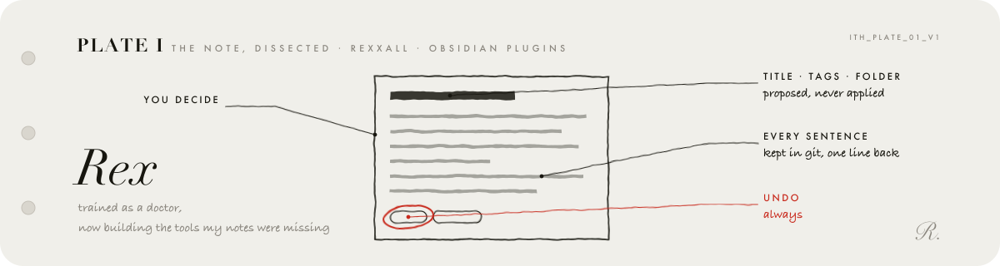</picture></a>

<a href="https://rexxall.github.io/"><b>rexxall.github.io</b></a>

### Obsidian plugins

<table>
<tr>
<td width="50%" valign="top">
<a href="https://community.obsidian.md/plugins/video-summary">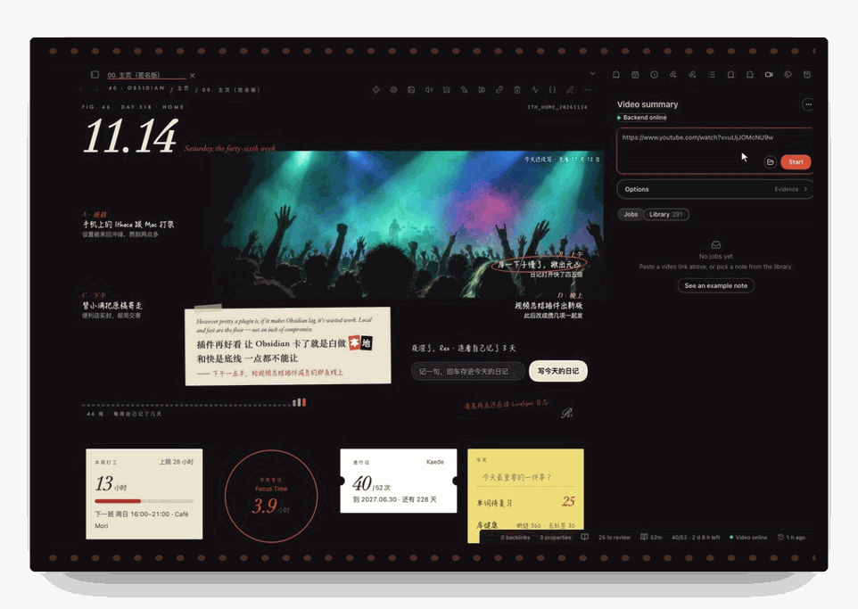</a>
<b>Video Summary</b> · <a href="https://github.com/Rexxall/obsidian-video-summary">code</a> · <a href="https://rexxall.github.io/video-summary/">the page</a> A video link in, a finished note out.
</td>
<td width="50%" valign="top">
<a href="https://community.obsidian.md/plugins/git-note-history">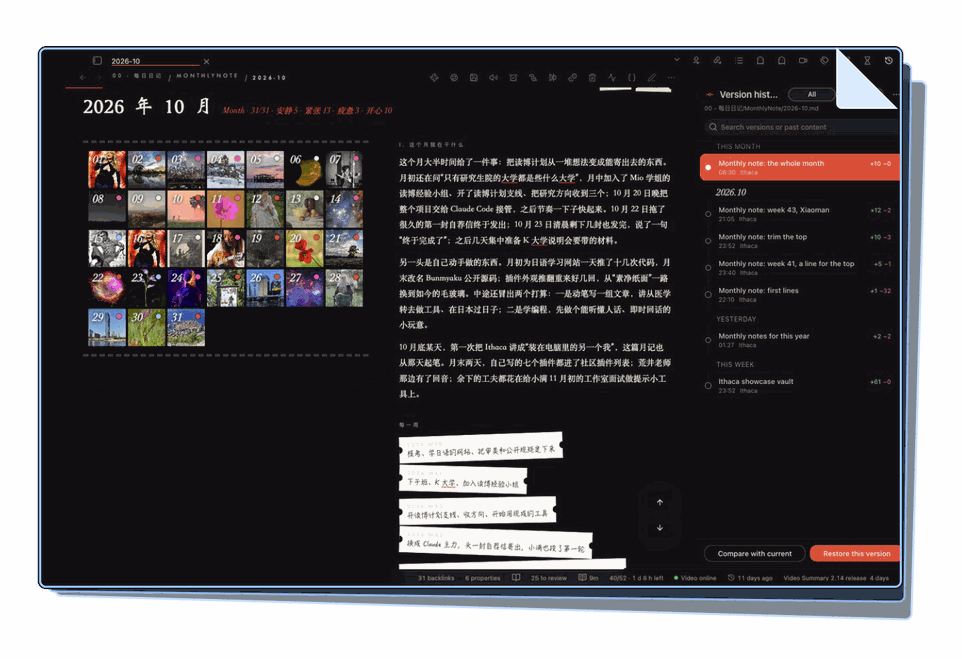</a>
<b>Git Note History</b> · <a href="https://github.com/Rexxall/obsidian-git-history-view">code</a> · <a href="https://rexxall.github.io/git-note-history/">the page</a> Find a sentence you deleted. Take back only that part.
</td>
</tr>
<tr>
<td width="50%" valign="top">
<a href="https://community.obsidian.md/plugins/polyglot-helper">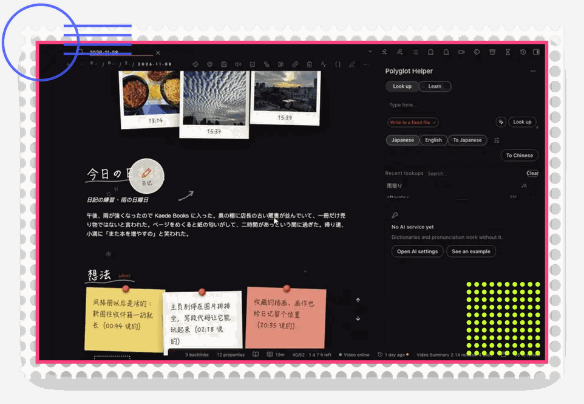</a>
<b>Polyglot Helper</b> · <a href="https://github.com/Rexxall/obsidian-polyglot-helper">code</a> · <a href="https://rexxall.github.io/polyglot-helper/">the page</a> Look up a word where you read. Meet it again.
</td>
<td width="50%" valign="top">
<a href="https://community.obsidian.md/plugins/tasknotes-countdown">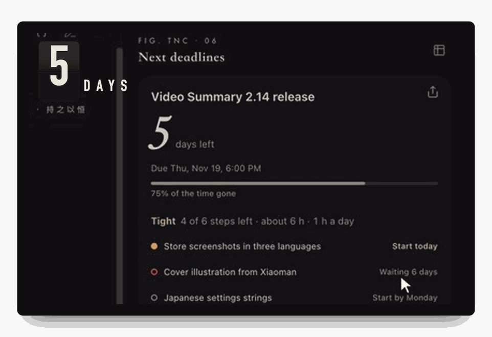</a>
<b>TaskNotes Countdown</b> · <a href="https://github.com/Rexxall/tasknotes-countdown">code</a> · <a href="https://rexxall.github.io/tasknotes-countdown/">the page</a> Deadlines from TaskNotes, and whether you will make it.
</td>
</tr>
<tr>
<td width="50%" valign="top">
<a href="https://community.obsidian.md/plugins/ai-assistant-suite">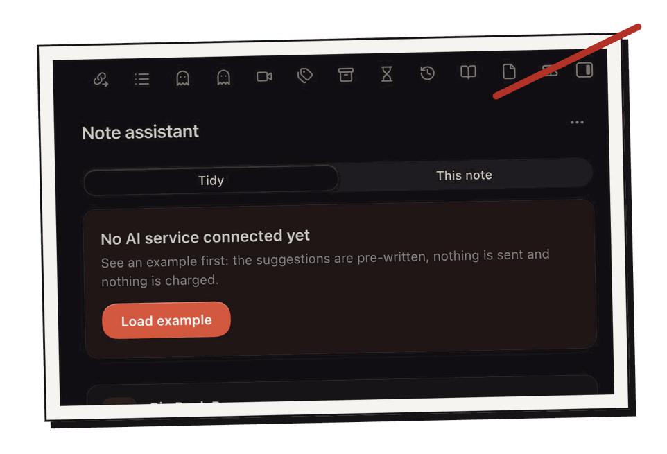</a>
<b>AI Assistant Suite</b> · <a href="https://github.com/Rexxall/obsidian-ai-assistant-suite">code</a> AI suggests title, tags and folder. You tick what to apply.
</td>
<td width="50%" valign="top">
<a href="https://community.obsidian.md/plugins/ai-accounting">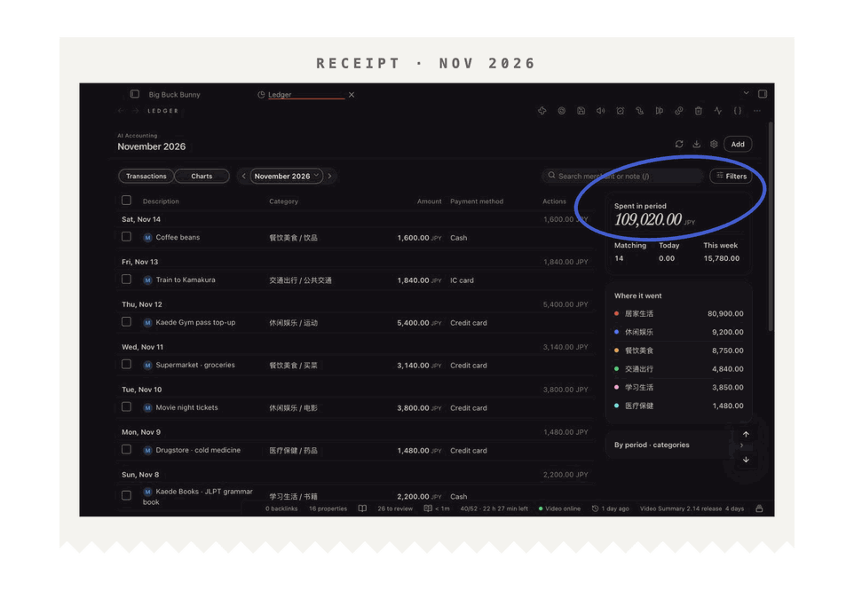</a>
<b>AI Accounting</b> · <a href="https://github.com/Rexxall/obsidian-ai-accounting">code</a> · <a href="https://rexxall.github.io/ai-accounting/">the page</a> A receipt in, a checked ledger entry out.
</td>
</tr>
<tr>
<td width="50%" valign="top">
<a href="https://community.obsidian.md/plugins/japan-work-secretary">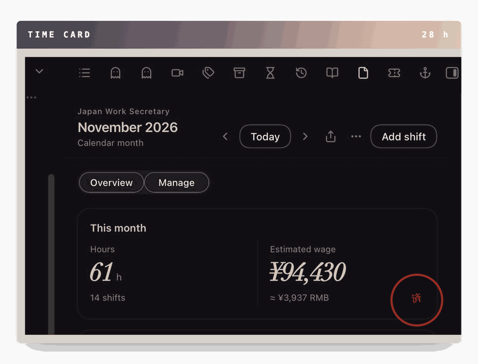</a>
<b>Japan Work Secretary</b> · <a href="https://github.com/Rexxall/japan-work-secretary">code</a> Part-time shifts in Japan, warned before 28 hours.
</td>
<td width="50%" valign="top">
<a href="https://community.obsidian.md/plugins/pass-countdown">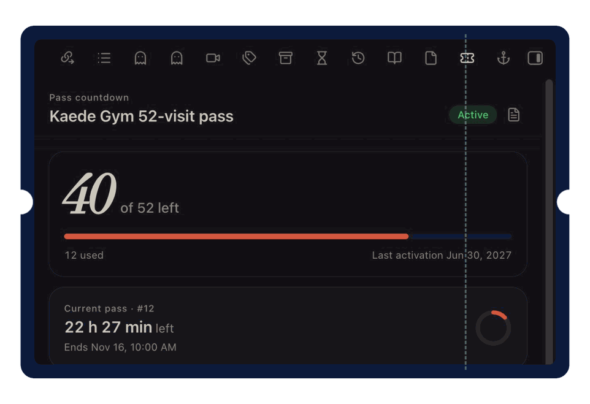</a>
<b>Pass Countdown</b> · <a href="https://github.com/Rexxall/obsidian-pass-countdown">code</a> Uses left, time left, and the pace to finish.
</td>
</tr>
</table>

AI features use your own key, with DeepSeek, Qwen, SiliconFlow, Kimi and Zhipu built in.

### Web apps

<picture>
  <source media="(prefers-color-scheme: dark)" srcset="assets/shelf/web-dark.png">
  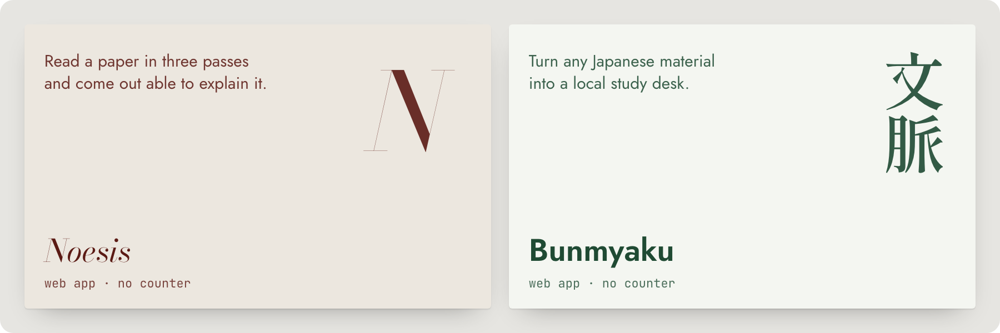
</picture>

[Noesis Paper Reader](https://github.com/Rexxall/noesis-paper-companion) · [open](https://rexxall.github.io/noesis-paper-companion/) &nbsp;·&nbsp; [Bunmyaku](https://github.com/Rexxall/bunmyaku-nihongo) &nbsp;·&nbsp; [Evidence Inbox](https://github.com/Rexxall/obsidian-evidence-inbox)

<picture>
  <source media="(prefers-color-scheme: dark)" srcset="assets/shelf/colophon-dark.png">
  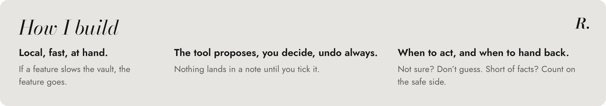
</picture>
